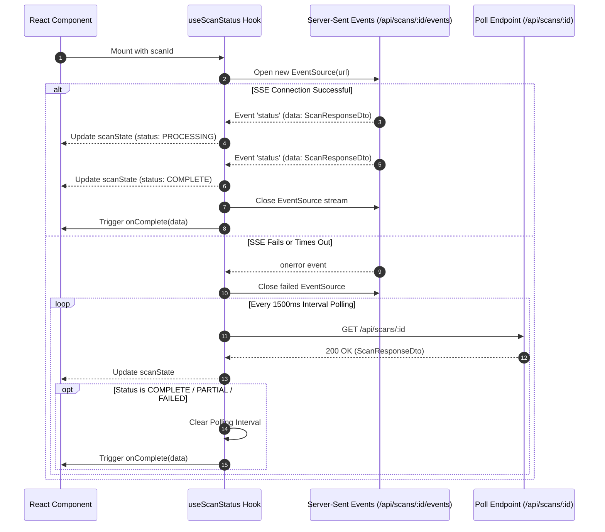
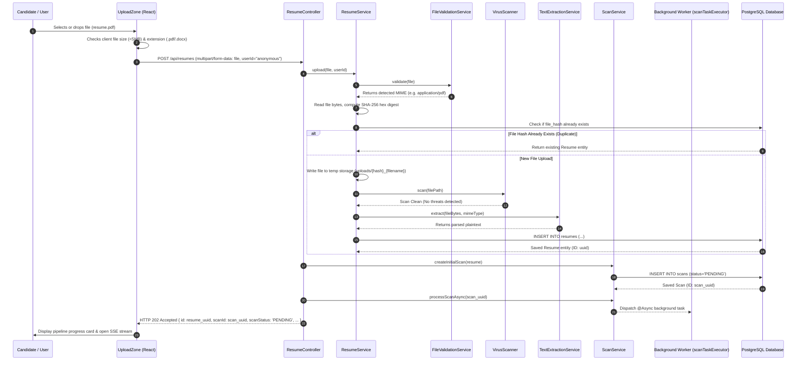
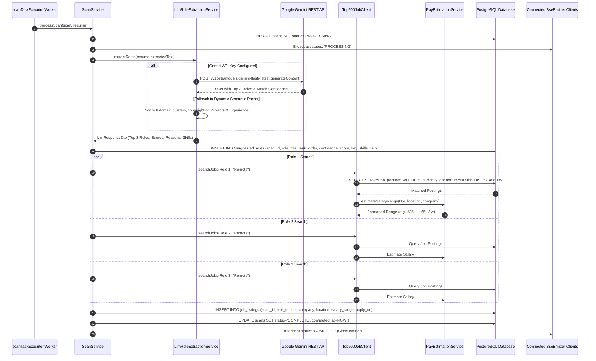
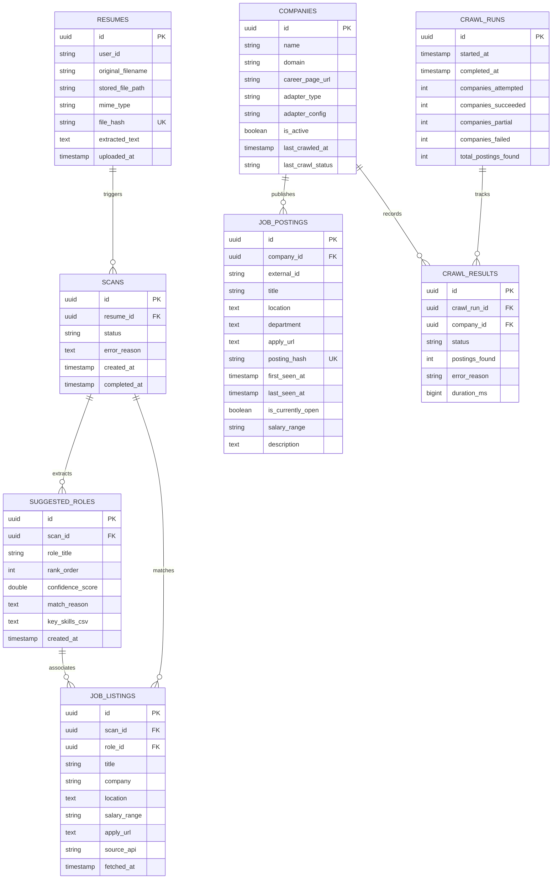

# Nous AI — Comprehensive System Architecture & Data Flow Specification

> **Document Status:** Complete & Verified against active codebase  
> **Target Scope:** Backend Architecture, Frontend Architecture, Real-Time Data Flow, Ingestion Pipeline, AI Role Classification, Enterprise Crawling Engine, and Database Schemas.

---

## 1. System Overview & Core Purpose

**Nous AI** is an enterprise-grade AI resume intelligence platform and automated job discovery engine. The system takes a candidate's unstructured resume document (PDF or DOCX), performs security validation and text extraction, executes multi-model LLM role classification (with dynamic semantic fallback), computes realistic market compensation bands, and matches the candidate against live job postings directly crawled from Top 500 Enterprise career portals (such as Microsoft, Amazon, Google, Meta, Stripe, Datadog, Uber, etc.).

### Technology Stack Summary

| Layer | Technologies / Frameworks | Key Purpose |
| :--- | :--- | :--- |
| **Frontend** | React 19, Vite, Vanilla CSS Design System | Single-page application, interactive filters, real-time SSE listener, multi-view dashboards |
| **Backend** | Java 17, Spring Boot 3.3.4, Spring MVC, Spring Data JPA | REST API controllers, asynchronous thread pools, cron scheduling, business service layer |
| **Persistence** | PostgreSQL (Neon DB in Prod) / H2 (Dev profile), Hibernate ORM | Relational data persistence, indexed deduplication, cascade management |
| **Document Processing** | Apache PDFBox 3.0.3, Apache POI 5.3.0, Apache Tika 2.9.2 | MIME magic-byte sniffing, plain text extraction from encrypted/unencrypted documents |
| **Security & Malware** | ClamAV Client (optional TCP daemon), Tika Content Inspector | Anti-malware scanning, file size checks, content validation |
| **AI / LLM Engine** | Google Gemini (Native REST), OpenAI / Groq / OpenRouter, Dynamic Semantic Engine | Candidate skill parsing, project-heavy weighted role scoring, confidence rank inference |
| **Scraping / Crawling** | Jsoup 1.17.2, Spring RestTemplate / RestClient, Jackson JSON | Schema.org JSON-LD extraction, ATS API parsing (Greenhouse, Lever, Workday, Amazon, Uber) |
| **Async & Streaming** | Spring `ThreadPoolTaskExecutor`, Server-Sent Events (`SseEmitter`), `CompletableFuture` | Non-blocking async execution, real-time UI streaming updates, multi-threaded portal crawling |

---

## 2. High-Level System Architecture

```mermaid
flowchart TB
    subgraph Client["Frontend Layer (React 19 + Vite)"]
        UI[App Dashboard]
        UZ[UploadZone Component]
        SSE[useScanStatus Hook\nEventSource / SSE]
        SRV[SuggestedRolesView]
        JLV[JobListingsView]
        UHV[UserHistoryView]
        TCV[Top500CrawlerView]
    end

    subgraph Gateway["Network & Routing"]
        VP[Vite Dev Proxy :5173]
        CORS[CorsConfig (All origins allowed)]
    end

    subgraph BackendControllers["Spring Boot Controller Layer (:8080)"]
        RC[ResumeController\n/api/resumes]
        SC[ScanController\n/api/scans]
        UC[UserController\n/api/users]
        CC[Top500CrawlController\n/api/top500]
        GEH[GlobalExceptionHandler\nRFC 7807 ProblemDetail]
    end

    subgraph CoreServices["Backend Service Layer"]
        RS[ResumeService]
        FVS[FileValidationService\n(Apache Tika)]
        VS[VirusScanner\n(ClamAV / NoOp)]
        TES[TextExtractionService\n(PDFBox / POI)]
        SS[ScanService\n(Async Orchestration)]
        LRE[LlmRoleExtractionService\n(Gemini / OpenAI / Semantic Parser)]
        PES[PayEstimationService\n(7 Regions, 7 Seniority Levels, 8 Domains)]
        T500JC[Top500JobClient / MockJobClient]
        COS[CrawlOrchestratorService]
        DES[DailyEnterpriseScreeningService]
    end

    subgraph Adapters["Enterprise Career Page Adapters"]
        GHA[GreenhouseAdapter]
        LVA[LeverAdapter]
        WDA[WorkdayAdapter]
        UBA[UberAdapter]
        AJA[AmazonJobsAdapter]
        GNA[GenericHtmlAdapter (Schema.org / Jsoup)]
    end

    subgraph AsyncExecution["Threading & Async Workers"]
        STE[scanTaskExecutor\n(Core: 4, Max: 10, Queue: 50)]
        FPE[Crawl ThreadPool\n(Fixed: 6 Threads)]
        SCHED[@Scheduled Cron\nDaily @ 12:00 PM IST]
    end

    subgraph Database["Persistence Layer (PostgreSQL / Neon DB)"]
        T_RES[resumes]
        T_SCN[scans]
        T_ROL[suggested_roles]
        T_LST[job_listings]
        T_CMP[companies]
        T_PST[job_postings]
        T_RUN[crawl_runs]
        T_RST[crawl_results]
    end

    UZ -->|POST /api/resumes multipart/form-data| VP --> RC
    SSE -->|GET /api/scans/:id/events SSE| VP --> SC
    SRV -->|GET /api/scans/:id/roles| VP --> SC
    JLV -->|GET /api/scans/:id/jobs| VP --> SC
    UHV -->|GET /api/users/:id/scans| VP --> UC
    TCV -->|GET /api/top500/companies, runs, postings| VP --> CC
    TCV -->|POST /api/top500/trigger| VP --> CC

    RC --> RS
    RS --> FVS
    RS --> VS
    RS --> TES
    RC --> SS

    SS -->|Dispatches task to| STE
    STE --> SS
    SS --> LRE
    SS --> T500JC
    T500JC --> PES
    T500JC --> T_PST

    SCHED --> COS
    SCHED --> DES
    CC --> COS
    COS -->|Dispatches portal crawls to| FPE
    FPE --> Adapters
    Adapters --> T_PST
    Adapters --> T_CMP

    RS --> T_RES
    SS --> T_SCN
    SS --> T_ROL
    SS --> T_LST
    COS --> T_RUN
    COS --> T_RST
```

---

## 3. Detailed Component Breakdown

### 3.1 Backend Architecture

#### 1. Configuration Modules (`com.project.nous.config`)
- **`AsyncConfig.java`**: Configures the `@EnableAsync` thread pool bean `scanTaskExecutor` with `corePoolSize = 4`, `maxPoolSize = 10`, `queueCapacity = 50`, and thread prefix `scan-worker-`. This prevents background text analysis and LLM calls from blocking Tomcat HTTP request threads.
- **`CorsConfig.java`**: Implements `WebMvcConfigurer` to register open CORS mappings (`/**`) supporting `GET`, `POST`, `PUT`, `DELETE`, `OPTIONS`, `PATCH` with wildcard origins and exposed headers.
- **`JobApiConfig.java`**: Initializes the `RestClient` bean `jobApiRestClient` configured with timeout factory (`4000ms` connect/read timeout) and default browser User-Agent headers.
- **`LlmConfig.java`**: Configures the `RestClient` bean `llmRestClient` with a `20000ms` connection and read timeout for external AI REST API calls.

#### 2. Domain Entities (`com.project.nous.domain`)
- **`Resume`** (`resumes` table):
  - Primary entity storing uploaded file metadata: `id` (UUID PK), `userId`, `originalFilename`, `storedFilePath`, `mimeType`, `fileHash` (SHA-256 unique index), `extractedText` (TEXT column), `uploadedAt` (Instant).
- **`Scan`** (`scans` table):
  - State machine run entity: `id` (UUID PK), `resumeId` (FK to `resumes`), `status` (Enum `ScanStatus`: `PENDING`, `PROCESSING`, `COMPLETE`, `PARTIAL`, `FAILED`), `errorReason`, `createdAt`, `completedAt`.
- **`SuggestedRole`** (`suggested_roles` table):
  - AI target role predictions: `id` (UUID PK), `scanId` (FK to `scans`), `roleTitle`, `rankOrder` (1-3), `confidenceScore` (0.00-1.00), `matchReason` (TEXT), `keySkillsCsv` (TEXT), `createdAt`.
- **`JobListing`** (`job_listings` table):
  - Matched job listings returned during a scan: `id` (UUID PK), `scanId` (FK), `roleId` (FK to `suggested_roles`), `title`, `company`, `location`, `salaryRange`, `applyUrl`, `sourceApi`, `fetchedAt`.
- **`Company`** (`companies` table):
  - Monitored corporate career portals: `id` (UUID PK), `name`, `domain`, `careerPageUrl`, `adapterType` (`GREENHOUSE`, `LEVER`, `WORKDAY`, `AMAZON`, `UBER`, `GENERIC_HTML`, `HEADLESS`), `adapterConfig` (board token/slug), `isActive`, `lastCrawledAt`, `lastCrawlStatus`.
- **`JobPosting`** (`job_postings` table):
  - Enterprise openings scraped from corporate portals: `id` (UUID PK), `company` (ManyToOne FK), `externalId`, `title`, `location`, `department`, `applyUrl`, `postingHash` (SHA-256 unique index of `company_id:title:applyUrl`), `firstSeenAt`, `lastSeenAt`, `isCurrentlyOpen` (boolean for soft-expiration), `salaryRange`, `description`.
- **`CrawlRun`** (`crawl_runs` table):
  - Daily batch execution logs: `id` (UUID PK), `startedAt`, `completedAt`, `companiesAttempted`, `companiesSucceeded`, `companiesPartial`, `companiesFailed`, `totalPostingsFound`.
- **`CrawlResult`** (`crawl_results` table):
  - Per-company crawl execution metrics: `id` (UUID PK), `crawlRun` (ManyToOne FK), `company` (ManyToOne FK), `status` (`SUCCESS`, `FAILED`, `BLOCKED`, `TIMEOUT`), `postingsFound`, `errorReason`, `durationMs`.

#### 3. Controller Layer (`com.project.nous.controller`)
- **`ResumeController.java`** (`/api/resumes`):
  - `POST /api/resumes`: Accepts `MultipartFile file` and `userId`. Validates file, scans for viruses, computes SHA-256, deduplicates, extracts text, creates initial `Scan` with status `PENDING`, dispatches async pipeline execution, and returns `HTTP 202 Accepted` with initial `ResumeResponseDto`.
  - `GET /api/resumes/{id}`: Returns resume metadata, character count, truncated preview, and latest scan status.
  - `GET /api/resumes/{id}/text`: Returns full plain extracted text as `text/plain`.
  - `DELETE /api/resumes/{id}`: Cascades deletion across database records (`scans`, `suggested_roles`, `job_listings`) and deletes the physical file on disk. Returns `HTTP 204 No Content`.
- **`ScanController.java`** (`/api/scans`):
  - `GET /api/scans/{scanId}`: Fetches current status enriched with filename and top recommended role.
  - `GET /api/scans/{scanId}/events`: Opens a real-time Server-Sent Events (`SseEmitter`) stream (`text/event-stream`, 5-minute timeout). Pushes immediate state and broadcasts transitions as the pipeline advances.
  - `GET /api/scans/resume/{resumeId}`: Returns all scan runs for a resume ID.
  - `GET /api/scans/{scanId}/roles` & `GET /api/scans/resume/{resumeId}/roles`: Returns list of `RoleSuggestionDto` with rank, confidence score, match rationale, and parsed skill arrays.
  - `GET /api/scans/{scanId}/jobs` & `GET /api/scans/resume/{resumeId}/jobs`: Returns list of `JobListingDto` with title, company, location, salary range, and deep apply link.
- **`Top500CrawlController.java`** (`/api/top500`):
  - `GET /api/top500/companies`: Returns all monitored enterprise companies.
  - `POST /api/top500/trigger`: Manually triggers asynchronous batch crawl execution across all verified portals.
  - `GET /api/top500/runs`: Returns last 10 crawl batch runs.
  - `GET /api/top500/postings?query=...`: Searches active enterprise openings with keyword and department filtering.
- **`UserController.java`** (`/api/users`):
  - `GET /api/users/{userId}/scans`: Fetches enriched scan evaluation history across all resumes uploaded by a user.
- **`GlobalExceptionHandler.java`**:
  - Global `@RestControllerAdvice` converting all exceptions into RFC 7807 `ProblemDetail` JSON responses with appropriate HTTP status codes (`400 Bad Request`, `404 Not Found`, `422 Unprocessable Entity`, `500 Internal Server Error`).

#### 4. Service Layer (`com.project.nous.service`)
- **`FileValidationService.java`**:
  - Validates non-empty status and enforces the `5 MB` size limit.
  - Utilizes **Apache Tika** magic byte detection to determine true MIME type (`application/pdf` or `application/vnd.openxmlformats-officedocument.wordprocessingml.document`), rejecting renamed binaries/scripts.
- **`VirusScanner.java` & Implementations**:
  - Interface defining `scan(Path filePath)`.
  - `NoOpVirusScanner.java`: Default development scanner logging a warning and allowing files.
  - `ClamAvVirusScanner.java`: Activated via `app.clamav.enabled=true`. Streams file bytes over TCP socket to ClamAV daemon (`localhost:3310`) and rejects threats with `VirusScanException`.
- **`TextExtractionService.java`**:
  - Extracts text from PDF bytes via Apache PDFBox `PDFTextStripper` (with `setSortByPosition(true)` to maintain reading order and encryption checks).
  - Extracts text from DOCX bytes via Apache POI `XWPFWordExtractor`.
- **`ResumeService.java`**:
  - Coordinates Phase 1 ingestion: Validation $\rightarrow$ Byte read $\rightarrow$ SHA-256 hash calculation $\rightarrow$ Deduplication check $\rightarrow$ Temp disk write $\rightarrow$ Virus scan $\rightarrow$ Text extraction $\rightarrow$ DB persistence.
- **`LlmRoleExtractionService.java`**:
  - Multi-tier AI role intelligence engine:
    1. **Google Gemini Live API**: Iterates through models (`gemini-flash-latest`, `gemini-2.5-flash`, `gemini-2.0-flash`, `gemini-2.0-flash-lite`, `gemini-1.5-flash-latest`). Uses system prompt instructing the model to act as a Staff Technical Recruiter giving 45% weight to project implementations, 30% to tech stack mastery, 15% to seniority/domain alignment, and 10% to tooling.
    2. **OpenAI / Groq / OpenRouter API**: Fallback chat completions endpoint with JSON schema output enforcement.
    3. **Dynamic Semantic Resume Parser**: Zero-static fallback evaluating 6 domain clusters (Backend & Distributed Systems, AI & Machine Learning, Frontend & Full Stack, Cloud Infrastructure & DevOps, Mobile Application Engineering, Data Engineering & Analytics). Applies **3x weight multiplier** for skills detected in the extracted Project/Experience sections and computes graduated confidence curves.
- **`PayEstimationService.java`**:
  - Market compensation calibration engine benchmarking salaries across:
    - **7 Geographic Regions & Currencies**: India (`INR ₹Lakhs`), US/Remote (`USD $k`), UK (`GBP £k`), Europe (`EUR €k`), Canada (`CAD $k`), Singapore (`SGD $k`), Australia (`AUD $k`).
    - **7 Seniority Levels**: Intern, Junior, Mid, Senior, Staff/Principal, Manager, Executive.
    - **8 Domain Specializations**: AI/Data (1.20x), Security (1.15x), Infrastructure/Backend (1.10x), Product (1.05x), Software Engineering (1.00x), Design (0.95x), Sales (0.90x), Business Ops (0.80x).
- **`Top500JobClient.java`**:
  - Primary job provider strategy. Searches the direct crawled `job_postings` database for target roles, calculates skill keyword overlap scores, dynamically estimates pay bands, and returns top 50 ranked openings.
- **`CrawlOrchestratorService.java`**:
  - Manages the Top 500 company directory synchronization and parallel multi-threaded crawling using a 6-thread pool.
  - Deduplicates jobs using SHA-256 hashes (`company_id:title:apply_url`), updates `last_seen_at`, and soft-expires postings not seen in the latest run (`is_currentlyOpen = false`).
- **`DailyEnterpriseScreeningService.java`**:
  - Automated `@Scheduled(cron = "0 0 12 * * *")` service running daily at 12:00 PM (Noon) to trigger batch screening across enterprise hiring portals.
- **`ScanService.java`**:
  - Master pipeline orchestrator. Executes `processScanAsync` on `scanTaskExecutor`. Updates status (`PENDING` $\rightarrow$ `PROCESSING` $\rightarrow$ `COMPLETE` / `PARTIAL` / `FAILED`), invokes LLM extraction, launches parallel `CompletableFuture` queries to the job search client for each role, persists entities, and pushes updates via `SseEmitter`.

---

## 4. Frontend Architecture & Component Hierarchy

The frontend is built with React 19 and Vite. It utilizes a modular component architecture with vanilla CSS design tokens defined in `frontend/src/index.css`.

### Component Tree

```
App.jsx
├── Navbar.jsx (Logo, Active Portals Badge, "New Scan" Action Button)
├── HeroSection.jsx (Headline & Subtitle, rendered when no active resume)
├── UploadZone.jsx (Drag & Drop zone, File size & extension validation, Step progress)
├── PipelineProgressView.jsx (Real-time progress wheel, Step stepper, ScanStatusBadge)
├── ResumeDetailView.jsx (Segmented Tab Controller)
│   ├── Segment 1: "Roles & Enterprise Openings"
│   │   ├── SuggestedRolesView.jsx
│   │   │   ├── RoleFilterControls.jsx (Keyword search, Min score slider)
│   │   │   └── RoleCard.jsx (Rank badge, Visual theme icon, Match %, Validated skills)
│   │   └── JobListingsView.jsx
│   │       ├── JobFilterControls.jsx (Search keyword, Location filter, Company dropdown, Role dropdown)
│   │       └── JobCard.jsx (Skill match %, Salary display in ₹ Lakhs, Dynamic deep apply link)
│   └── Segment 2: "Extracted Resume Text"
│       └── Plaintext viewer with search term highlighting and clipboard copy
├── Top500CrawlerView.jsx (Monitored company portals, 3-state crawl trigger button, Live postings list)
├── UserHistoryView.jsx (Evaluated resumes list, Status filter pills, Resume selector)
└── SettingsView.jsx (Provider preferences, Custom API key inputs, Local storage clearance)
```

### Real-Time Pipeline Streaming: `useScanStatus.js`

The custom hook `useScanStatus(scanId, intervalMs = 1500, onComplete)` implements a resilient dual-channel communication strategy:



---

## 5. End-to-End Data Flow & API Communication

### Protocol 1: Resume Upload & Ingestion



### Protocol 2: Async AI Analysis & Job Matching Pipeline



---

## 6. Complete API Endpoint Reference & Payloads

### 1. Resume Ingestion & Lookup

#### `POST /api/resumes`
- **Request Headers:** `Content-Type: multipart/form-data`
- **Form Data:**
  - `file`: Binary file (`.pdf` or `.docx`, max 5MB)
  - `userId`: String (optional, default: `"anonymous"`)
- **Success Response (202 Accepted):**
```json
{
  "id": "7c9e6679-7425-40de-944b-e07fc1f90ae7",
  "userId": "anonymous",
  "originalFilename": "John_Doe_Software_Engineer.pdf",
  "mimeType": "application/pdf",
  "uploadedAt": "2026-08-21T02:24:00Z",
  "extractedCharCount": 4520,
  "extractedTextPreview": "John Doe\nSenior Backend Engineer\nExperience with Java, Spring Boot, Microservices...",
  "extractedText": "John Doe\nSenior Backend Engineer\n...",
  "isDuplicate": false,
  "scanId": "3b12a819-21b9-4a41-b0e2-892bc931f822",
  "scanStatus": "PENDING"
}
```

#### `GET /api/resumes/{id}`
- **Response (200 OK):**
```json
{
  "id": "7c9e6679-7425-40de-944b-e07fc1f90ae7",
  "userId": "anonymous",
  "originalFilename": "John_Doe_Software_Engineer.pdf",
  "mimeType": "application/pdf",
  "uploadedAt": "2026-08-21T02:24:00Z",
  "extractedCharCount": 4520,
  "extractedTextPreview": "John Doe\nSenior Backend Engineer...",
  "extractedText": "John Doe\n...",
  "isDuplicate": false,
  "scanId": "3b12a819-21b9-4a41-b0e2-892bc931f822",
  "scanStatus": "COMPLETE"
}
```

#### `DELETE /api/resumes/{id}`
- **Response:** `204 No Content` (Physical file deleted from disk; associated `scans`, `suggested_roles`, and `job_listings` deleted from DB).

---

### 2. Scan Engine & AI Role Intelligence

#### `GET /api/scans/{scanId}`
- **Response (200 OK):**
```json
{
  "scanId": "3b12a819-21b9-4a41-b0e2-892bc931f822",
  "resumeId": "7c9e6679-7425-40de-944b-e07fc1f90ae7",
  "status": "COMPLETE",
  "errorReason": null,
  "createdAt": "2026-08-21T02:24:00Z",
  "completedAt": "2026-08-21T02:24:02Z",
  "originalFilename": "John_Doe_Software_Engineer.pdf",
  "bestMatchRole": "Senior Java Backend Engineer",
  "matchConfidence": 0.94,
  "matchReason": "Proven project implementation & technical alignment with Backend & Distributed Systems demonstrated across Java, Spring Boot, Microservices, PostgreSQL (94% match score)."
}
```

#### `GET /api/scans/{scanId}/events`
- **Response:** `text/event-stream` (Server-Sent Events)
- **Event Packet Format:**
```
event: status
data: {"scanId":"3b12a819-21b9-4a41-b0e2-892bc931f822","resumeId":"7c9e6679-7425-40de-944b-e07fc1f90ae7","status":"PROCESSING",...}

event: status
data: {"scanId":"3b12a819-21b9-4a41-b0e2-892bc931f822","resumeId":"7c9e6679-7425-40de-944b-e07fc1f90ae7","status":"COMPLETE",...}
```

#### `GET /api/scans/{scanId}/roles`
- **Response (200 OK):**
```json
[
  {
    "id": "e4f3a109-1234-4567-89ab-cdef01234567",
    "roleTitle": "Senior Java Backend Engineer",
    "rank": 1,
    "confidenceScore": 0.94,
    "matchReason": "Proven project implementation & technical alignment with Backend & Distributed Systems demonstrated across Java, Spring Boot, PostgreSQL.",
    "keySkills": ["Java", "Spring Boot", "Microservices", "REST APIs", "PostgreSQL"]
  },
  {
    "id": "f5a4b210-2345-5678-9abc-def012345678",
    "roleTitle": "Cloud Infrastructure & DevOps Engineer",
    "rank": 2,
    "confidenceScore": 0.87,
    "matchReason": "Demonstrated Docker containerization, AWS cloud deployments, and CI/CD pipelines in production projects.",
    "keySkills": ["Docker", "Kubernetes", "AWS", "CI/CD", "Linux"]
  },
  {
    "id": "a6b5c321-3456-6789-abcd-ef0123456789",
    "roleTitle": "Full Stack Software Engineer",
    "rank": 3,
    "confidenceScore": 0.81,
    "matchReason": "Solid proficiency integrating React frontends with Spring Boot REST API services.",
    "keySkills": ["React", "TypeScript", "JavaScript", "REST APIs", "HTML/CSS"]
  }
]
```

#### `GET /api/scans/{scanId}/jobs`
- **Response (200 OK):**
```json
[
  {
    "id": "c1d2e3f4-5678-90ab-cdef-1234567890ab",
    "scanId": "3b12a819-21b9-4a41-b0e2-892bc931f822",
    "roleId": "e4f3a109-1234-4567-89ab-cdef01234567",
    "title": "Principal Java Backend Engineer - Azure Core",
    "company": "Microsoft",
    "location": "Bangalore, Karnataka, India",
    "salaryRange": "₹38L - ₹65L / yr",
    "applyUrl": "https://jobs.careers.microsoft.com/global/en/job/1784920/Principal-Software-Engineer",
    "sourceApi": "Top 500 Enterprise"
  },
  {
    "id": "d2e3f4a5-6789-01bc-def1-234567890abc",
    "scanId": "3b12a819-21b9-4a41-b0e2-892bc931f822",
    "roleId": "e4f3a109-1234-4567-89ab-cdef01234567",
    "title": "Software Development Engineer - AWS Java Cloud",
    "company": "Amazon",
    "location": "Bangalore, Karnataka, India",
    "salaryRange": "₹36L - ₹62L / yr",
    "applyUrl": "https://www.amazon.jobs/en/jobs/2849102/",
    "sourceApi": "Top 500 Enterprise"
  }
]
```

---

### 3. Top 500 Crawler & Administration

#### `GET /api/top500/companies`
- **Response (200 OK):** Returns array of monitored company entities (`Stripe`, `Datadog`, `MongoDB`, `Cloudflare`, `Okta`, `Amazon`, `Uber`, etc.).

#### `POST /api/top500/trigger`
- **Response (200 OK):** Returns the newly created `CrawlRun` batch entity and initiates multi-threaded parallel crawling across all active portals.

#### `GET /api/top500/postings?query=java`
- **Response (200 OK):** Returns open postings matching `"java"` across corporate portals with live deep application URLs and estimated compensation.

---

### 4. Error Responses (RFC 7807 ProblemDetail)

Whenever an operation fails, the backend returns a standardized RFC 7807 `ProblemDetail` JSON payload:
```json
{
  "type": "https://nous.app/errors/invalid-file",
  "title": "Bad Request",
  "status": 400,
  "detail": "File type 'application/x-msdownload' is not supported. Only PDF and DOCX files are accepted. (Detected from file content, not extension.)",
  "instance": "/api/resumes",
  "timestamp": "2026-08-21T02:24:00.123456Z"
}
```

---

## 7. Database Entity Relationship (ER) Model



---

## 8. Security, Fault Tolerance & Performance Optimizations

1. **Magic-Byte Sniffing Security**:
   - Attackers renaming executable files (e.g. `malware.exe` to `resume.pdf`) are caught instantly by Apache Tika analyzing the raw byte headers, throwing `InvalidFileException`.
2. **SHA-256 Ingestion Deduplication**:
   - Resumes are hashed using SHA-256 upon byte read. If the exact same file is uploaded again, the backend reuses the existing `Resume` record, avoiding redundant disk writes and database unique constraint violations.
3. **Dual-Channel Frontend Streaming with Automatic Fallback**:
   - The UI tries Server-Sent Events (`EventSource`) first for instantaneous push notifications. If SSE fails or times out in constrained environments, it smoothly downgrades to 1500ms REST polling without user disruption.
4. **Partial Failure Resilience (`ScanStatus.PARTIAL`)**:
   - If AI role extraction succeeds but external portal requests time out, the scan is flagged as `PARTIAL` rather than crashing, ensuring candidate roles and partial listings remain accessible to the user.
5. **Parallel Multi-Threaded Crawling & Async Thread Pools**:
   - Resume processing is offloaded to `scanTaskExecutor` (ThreadPoolTaskExecutor with 4-10 workers).
   - Enterprise crawling runs concurrently across 6 worker threads with strict per-portal timeouts (12 seconds) and automatic retry boundaries.
6. **Market Pay Estimation Accuracy**:
   - The compensation engine accurately factors role seniority, domain multiplier, and location (e.g. converting `₹` into clean Lakhs bands like `₹35L - ₹65L / yr`).
7. **Privacy Compliance & Right to Erasure**:
   - Deleting a resume cascades through `job_listings`, `suggested_roles`, and `scans`, followed by physical file removal from disk.
