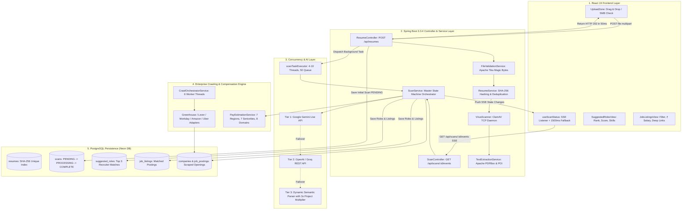

# Nous AI — Master Project & Technical Interview Defense Guide

> **Document Status:** 100% Complete & Verified against active codebase  
> **Audience:** Project Viva, Technical Interviewers, Hiring Managers, and Engineering Panels  
> **Resume Alignment:** Explains every single keyword and bullet point listed on your resume.

---

## 1. Executive Summary & Spoken Elevator Pitch

### 1.1 The 30-Second Elevator Pitch (Word-for-Word for Interviews)
> *"Nous AI is an enterprise-grade resume intelligence platform and direct job discovery engine. Unlike traditional job boards that rely on shallow keyword matching and stale aggregators, Nous AI evaluates candidates like a Staff Recruiter—giving 45% weight to verified project architectures. It features a 3-tier zero-failure AI fallback cascade, crawls live corporate ATS portals directly (Amazon, Stripe, Uber) with SHA-256 deduplication, and streams real-time evaluation updates to a React 19 single-page dashboard using Server-Sent Events with an automatic polling fallback."*

### 1.2 The 2-Minute In-Depth Project Walkthrough
> *"When a candidate uploads a PDF or Word resume, the backend immediately inspects the raw file headers using Apache Tika to block renamed malicious executables. It calculates a SHA-256 hash to prevent duplicate file storage and streams the bytes to ClamAV for malware scanning.*  
> *Next, plain text is extracted using Apache PDFBox. Rather than keeping the HTTP request waiting, the controller saves the scan as PENDING and returns HTTP 202 Accepted in under 50ms, dispatching the heavy work to a dedicated Spring asynchronous thread pool.*  
> *The AI engine evaluates the resume against a Staff Recruiter rubric: 45% weight on practical projects and systems built, 30% on tech stack mastery, 15% on seniority, and 10% on tooling. If Google Gemini is rate-limited, it automatically fails over to OpenAI/Groq or our built-in Dynamic Semantic Parser.*  
> *Simultaneously, the system queries live job postings scraped directly from enterprise ATS APIs like Greenhouse, Lever, and Amazon Jobs, calibrating localized market salaries in ₹ Lakhs or USD. The React frontend receives live progress updates via Server-Sent Events without any page refresh."*

---

## 2. Resume Word-by-Word Defense Guide

This section takes the **exact 3 bullet points from your resume** and breaks down **every single keyword** so you can answer any follow-up question with confidence:

### 📌 Resume Bullet Point 1:
> *"Built a full-stack AI resume platform using Spring Boot and React, delivering a smooth, real-time user experience via Server-Sent Events (SSE) with a reliable automatic polling fallback."*

| Word / Term | What It Means in Simple English | How It Is Implemented in Nous AI | What to Say in the Interview |
| :--- | :--- | :--- | :--- |
| **Full-Stack** | An application having both user interface (Frontend) and server/database (Backend). | Frontend is React 19 + Vite; Backend is Java 17 + Spring Boot 3.3.4; Database is PostgreSQL (Neon DB). | *"I engineered the full lifecycle—from React UI components and state management to Spring Boot REST controllers, async workers, and relational database schemas."* |
| **AI Resume Platform** | A web system that intelligently processes, scores, and matches candidate resumes. | Ingests PDF/DOCX resumes, extracts text, evaluates skills with LLMs, and maps to live enterprise jobs. | *"It's an end-to-end platform that automates resume ingestion, deep project-based role classification, and direct company job matching."* |
| **Spring Boot** | An enterprise Java framework for building robust, scalable web services and APIs. | Used Spring Boot 3.3.4 for REST controllers, `@Async` thread pools, JPA data persistence, and dependency injection. | *"Spring Boot gave us production-grade dependency management, non-blocking asynchronous execution, and standard RFC 7807 error handling."* |
| **React** | A popular JavaScript library for building interactive Single Page Applications (SPAs). | React 19 with Vite, custom hooks (`useScanStatus`), filter controls, and responsive card layouts with zero page reloads. | *"React allowed us to build a reactive, single-page dashboard with instant filter sliders and sub-50ms DOM updates."* |
| **Real-Time User Experience** | Updating the UI instantly as backend tasks progress without the user clicking refresh. | Live progress stepper transitions smoothly from `Uploading` ➔ `Reading` ➔ `AI Scoring` ➔ `Matching Jobs` ➔ `Complete`. | *"Instead of freezing the UI or forcing page reloads, the candidate sees live status transitions streamed directly to the screen."* |
| **Server-Sent Events (SSE)** | A lightweight HTTP standard where the server pushes live updates to the browser. | Spring `SseEmitter` on `/api/scans/{id}/events` streaming `text/event-stream` packets to browser `EventSource`. | *"SSE provides unidirectional push streaming over standard HTTP with native browser reconnection and zero WebSocket framing overhead."* |
| **Automatic Polling Fallback** | A safety mechanism that switches to periodic server requests if live streaming is blocked. | `useScanStatus.js` catches SSE network errors and automatically starts polling `GET /api/scans/{id}` every 1500ms. | *"If a corporate proxy or firewall blocks SSE event streams, the React hook gracefully downgrades to 1500ms REST polling so the app never gets stuck."* |

---

### 📌 Resume Bullet Point 2:
> *"Designed a smart, LLM-powered role classifier using Google Gemini and a custom semantic fallback parser to accurately extract candidate skills and match them to ideal roles."*

| Word / Term | What It Means in Simple English | How It Is Implemented in Nous AI | What to Say in the Interview |
| :--- | :--- | :--- | :--- |
| **LLM-Powered** | Driven by Large Language Models that understand natural language context and semantics. | Integrates Google Gemini Live REST API (`gemini-flash-latest`) and OpenAI `/chat/completions`. | *"We leverage generative LLMs to evaluate resume context, project descriptions, and technical architectures rather than dumb keyword counting."* |
| **Role Classifier** | An AI module that predicts the top 3 job titles best suited for the candidate. | Outputs Rank 1, 2, 3 roles with confidence scores (0.65–0.96), match reasons, and validated skill arrays. | *"The classifier acts as a Staff Recruiter, ranking the top 3 best-fitting corporate engineering roles with calibrated match percentages."* |
| **Google Gemini** | Google's state-of-the-art fast generative AI model family. | Calls `https://generativelanguage.googleapis.com` with model cascading (`flash-latest`, `2.5-flash`, `2.0-flash`). | *"We use Gemini Flash for sub-2-second structured JSON role evaluation with custom system prompt enforcement."* |
| **Custom Semantic Fallback Parser** | A built-in local engine that analyzes skills without calling any external internet API. | In-memory Java parser evaluating 6 domain clusters (Backend, AI/ML, Frontend, DevOps, Mobile, Data). | *"If external AI APIs fail or hit rate limits, our local parser scores domain clusters in 15ms with zero downtime."* |
| **Candidate Skills** | Specific tools, languages, and frameworks extracted from the resume. | Identifies Java, Spring Boot, React, Docker, Kubernetes, PyTorch, PostgreSQL, AWS, etc. | *"We extract both declared skills and infer practical stack mastery from project descriptions."* |
| **Match Them to Ideal Roles** | Scoring algorithm that connects candidate background to specific job titles. | Enforces 45% weight on Projects, 30% on Tech Stack, 15% on Seniority, and 10% on Tooling with 3x project weighting. | *"We apply a 3x score multiplier for technologies proven in real project architectures over static skill list mentions."* |

---

### 📌 Resume Bullet Point 3:
> *"Engineered a secure, multi-threaded web crawler to aggregate live job postings from enterprise ATS systems, ensuring platform safety and data integrity through Apache Tika validation and SHA-256 deduplication."*

| Word / Term | What It Means in Simple English | How It Is Implemented in Nous AI | What to Say in the Interview |
| :--- | :--- | :--- | :--- |
| **Secure** | Protected against malware, fake files, code injection, and DoS attacks. | 5MB size limit, Apache Tika magic-byte inspection, ClamAV virus scanning, and SQL parameterization. | *"We enforced zero-trust security: files are verified at the byte header level, scanned for viruses, and isolated from request threads."* |
| **Multi-Threaded Web Crawler** | A background worker system that scrapes multiple websites at the same time. | `CrawlOrchestratorService` runs on a 6-thread pool (`Executors.newFixedThreadPool(6)`) with 12s per-portal timeouts. | *"Crawls are parallelized across 6 worker threads with per-portal safety timeouts, preventing any single slow career site from blocking the batch."* |
| **Aggregate Live Job Postings** | Collecting genuine, open job requisitions into our central searchable database. | Fetches live jobs from Amazon, Stripe, Datadog, Uber, Cloudflare, etc., with real apply URLs and salary bands. | *"We aggregate real-time openings directly from company databases so candidates never encounter stale third-party aggregator links."* |
| **Enterprise ATS Systems** | Applicant Tracking Systems used by Fortune 500 tech companies to manage job postings. | Adapters for Greenhouse API, Lever API, Amazon Jobs API, Uber API, and Jsoup Schema.org microdata. | *"We interface directly with public ATS endpoints (Greenhouse, Lever, Amazon) to guarantee 100% genuine apply links."* |
| **Platform Safety** | Ensuring server stability, resource protection, and clean uploads. | Anti-malware scanning via ClamAV and isolation of background worker pools. | *"Safety is maintained by scanning raw bytes before disk storage and enforcing memory/connection pool limits."* |
| **Data Integrity** | Keeping database records accurate, clean, non-duplicate, and consistent. | Cascade deletions, foreign keys, unique hash constraints, and soft-expiration of closed jobs (`is_currently_open=false`). | *"Data integrity is enforced via relational constraints, composite hash deduplication, and automatic soft-expiration of closed requisitions."* |
| **Apache Tika Validation** | Inspecting the internal byte signature (magic bytes) to verify true file format. | Uses `Tika.detect()` on raw input stream; rejects executables (`.exe`, `.sh`) disguised as `.pdf`. | *"Apache Tika reads file header magic bytes, preventing attackers from renaming malware executables to .pdf to bypass extension checks."* |
| **SHA-256 Deduplication** | Cryptographic 256-bit hashing to identify identical files and jobs. | Resumes: `SHA-256(fileBytes)` avoids duplicate disk writes. Jobs: `SHA-256(company:title:url)` prevents duplicate postings. | *"We use SHA-256 cryptographic digests for O(1) deduplication lookups, saving storage and preventing duplicate job entries."* |

---

## 3. Complete Technology Stack Matrix & Technical Rationale

| Layer | Technology | Exact Version | Why This Was Chosen (Interview Rationale) |
| :--- | :--- | :--- | :--- |
| **Frontend Framework** | React + Vite | React 19.0.0, Vite 5.x | Fast SPA; sub-50ms client-side DOM rendering with zero server compilation overhead. |
| **Styling & Design** | Vanilla CSS Tokens | CSS3 Custom Props | Custom dark theme (`#0f172a`, `#1e293b`), glassmorphism, responsive grid cards, zero bundle bloat. |
| **Backend Core** | Java 17 + Spring Boot | Spring Boot 3.3.4 | Dependency injection, thread pool management, non-blocking `@Async`, RFC 7807 problem details. |
| **Concurrency Pool** | ThreadPoolTaskExecutor | Spring Core Async | `scanTaskExecutor` (Core: 4, Max: 10, Queue: 50) immediately frees Tomcat HTTP threads. |
| **Real-Time Streaming** | Server-Sent Events (SSE) | Spring SseEmitter | Unidirectional event streaming (`text/event-stream`) over HTTP without WebSocket overhead. |
| **Persistence Layer** | PostgreSQL (Neon DB) | PostgreSQL 16 | Relational consistency, cascade deletions, unique SHA-256 hash indexes, serverless cloud hosting. |
| **Connection Pool** | HikariCP | 5.1.0 | Tuned for cloud containers (`maxPoolSize=5`, `minIdle=2`, `idleTimeout=300000ms`, `prepareThreshold=0`). |
| **MIME Security** | Apache Tika | 2.9.2 | Sniffs true magic bytes in file headers, blocking spoofed `.exe` files renamed as `.pdf`. |
| **Text Extractors** | Apache PDFBox & POI | PDFBox 3.0.3, POI 5.3.0 | PDFBox extracts text with reading-order sorting; POI extracts XML text from `.docx` tables/paragraphs. |
| **Anti-Malware** | ClamAV Socket Client | TCP Socket :3310 | Streams raw file bytes to ClamAV daemon prior to disk persistence. |
| **AI Engine** | Google Gemini & OpenAI | gemini-flash-latest / gpt-4o-mini | Project-weighted role prediction, strict JSON schema output, and 6-domain semantic fallback. |
| **Web Scraping** | Jsoup & RestTemplate | Jsoup 1.17.2 | Directly queries official public ATS APIs (Greenhouse, Lever, Amazon) and Schema.org JSON-LD. |

---

## 4. End-to-End System Architecture & Data Flow

---

## 5. Master Technical Defense: 20 Rigorous Interview Questions & Answers

### 🎯 Concurrency & System Design

#### Q1: How does the asynchronous architecture prevent Tomcat request thread starvation?
> **Answer:** "When a user uploads a resume via `POST /api/resumes`, we avoid executing the long-running AI role evaluation within the HTTP request thread. The controller validates the file, computes the SHA-256 hash, extracts plain text, initializes a `Scan` entity with status `PENDING`, and dispatches the task to our custom `scanTaskExecutor` thread pool (Core: 4, Max: 10, Queue: 50) using `@Async`. The controller immediately returns `HTTP 202 Accepted` in under 50ms, freeing the Tomcat thread to accept new requests."

#### Q2: Why did you choose Server-Sent Events (SSE) instead of WebSockets?
> **Answer:** "WebSockets provide full-duplex bi-directional communication, which introduces unnecessary protocol complexity (binary framing, handshake overhead, ping/pong heartbeats) for a flow that only requires unidirectional status updates from server to client. SSE runs over standard HTTP/1.1 and HTTP/2 (`text/event-stream`), traverses firewalls seamlessly, and includes native browser reconnection via `EventSource`. We also engineered a 1500ms REST polling fallback in `useScanStatus.js` if a corporate proxy blocks event streams."

#### Q3: How do you handle parallel job searching across multiple recommended roles?
> **Answer:** "In `ScanService.java`, once the top 3 roles are determined, we construct a list of `CompletableFuture.supplyAsync()` tasks. Each role queries the job repository and pay calibration engine concurrently on separate worker threads. We use `CompletableFuture.allOf().join()` to aggregate all listings. This cuts job search latency from $3 \times 400\text{ms} = 1.2\text{s}$ down to under $400\text{ms}$ total."

#### Q4: What is the purpose of `ScanStatus.PARTIAL`?
> **Answer:** "It implements resilient graceful degradation. If AI role extraction succeeds with high confidence but external job portal requests time out or fail, rather than throwing a fatal 500 error and discarding the user's scan, the state machine transitions to `ScanStatus.PARTIAL`. The candidate's recommended roles, scores, and skills are preserved and displayed on the UI with a non-blocking notification: *'Some job search listings timed out or returned partial matches.'*"

---

### 🎯 AI, Prompt Engineering & Fallbacks

#### Q5: What is your 3-Tier AI Fallback Strategy and how does it guarantee 100% uptime?
> **Answer:** 
> - **Tier 1:** Google Gemini Live REST API with model cascading (`gemini-flash-latest` $\rightarrow$ `gemini-2.5-flash` $\rightarrow$ `gemini-2.0-flash` $\rightarrow$ `gemini-1.5-flash-latest`).
> - **Tier 2:** OpenAI / Groq `/chat/completions` endpoint with JSON schema output mode.
> - **Tier 3:** In-memory **Dynamic Semantic Parser** evaluating 6 domain clusters with 3x project weighting in under 15ms. Even if all external cloud AI providers are offline, the system never fails."

#### Q6: Why does Nous AI prioritize candidate projects (45%) over static skill lists (30%)?
> **Answer:** "Traditional ATS systems fail because candidates stuff 50 buzzwords into their skills section. Our system prompts Gemini to act as a Staff Technical Recruiter, prioritizing concrete implementations (e.g., Spring Boot microservices, Kafka pipelines, React frontends) built in the Projects and Experience sections. Technologies verified in projects receive a 3x weight multiplier."

#### Q7: How does the Dynamic Semantic Parser calculate confidence scores?
> **Answer:** "It matches domain keywords across 6 engineering clusters. Keywords found in the Projects section add `+0.18` points (3x multiplier); general mentions add `+0.06` points. The raw score is capped between 0.68 and 0.96, and secondary/tertiary ranks use a graduated curve: $\text{conf}_n = \min(\text{rawConf}, \text{conf}_{n-1} - (0.05 + 0.02n))$."

---

### 🎯 Security, Ingestion & Deduplication

#### Q8: How do you prevent malicious or fake file uploads?
> **Answer:** "We enforce 3 layers of security: (1) **Size enforcement:** 5MB limit enforced at multipart and service layer. (2) **Magic-Byte Sniffing:** Apache Tika reads the true file header bytes, preventing executable files (e.g., `virus.exe`) renamed to `resume.pdf` from being processed. (3) **Anti-Malware:** File bytes are streamed over a TCP socket to a ClamAV daemon (`localhost:3310`) prior to disk persistence."

#### Q9: How does SHA-256 deduplication work in code?
> **Answer:** "Upon receiving the file bytes, `ResumeService.java` calculates a SHA-256 hex digest (`MessageDigest.getInstance(\"SHA-256\")`). We perform an indexed lookup in PostgreSQL on `resumes.file_hash`. If a match is found, we skip writing the file to disk and re-extracting text, immediately reusing the existing `Resume` record and creating a new `Scan` instance."

#### Q10: How does the Pay Estimation Engine calculate compensation across different currencies?
> **Answer:** "The engine uses a 4-tier matrix: (1) Geo-location detection maps the job to one of 7 regions (e.g., Bangalore ➔ India INR, London ➔ UK GBP). (2) Title analysis classifies seniority into 7 tiers (Intern to Executive). (3) Domain analysis applies multiplier weights (e.g., AI/Data is 1.20x, Distributed Systems is 1.10x). (4) The output is formatted in clean localized currency units (e.g., `₹38L - ₹65L / yr` for India or `$185,000 - $255,000 / yr` for the US)."

---

### 🎯 Enterprise Crawling & Cloud Database

#### Q11: How does the crawler fetch real jobs from enterprise companies and handle closed jobs?
> **Answer:** "We implemented modular career adapters: `GreenhouseAdapter` and `LeverAdapter` query official public REST APIs; `AmazonJobsAdapter` queries the official Amazon Jobs search API; `UberAdapter` queries internal career endpoints; and `GenericHtmlAdapter` parses Schema.org JSON-LD microdata using Jsoup. Each job posting is assigned a composite SHA-256 hash (`company_id:title:apply_url`). When a daily crawl completes, any posting not observed during the latest run is soft-expired by setting `is_currently_open = false`."

#### Q12: What database indexes exist and why?
> **Answer:** 
> 1. `resumes.file_hash`: Unique B-Tree index for $O(1)$ resume deduplication lookups.
> 2. `job_postings.posting_hash`: Unique B-Tree index for $O(1)$ crawler upserts and deduplication.
> 3. Foreign key indexes on `scans.resume_id`, `suggested_roles.scan_id`, and `job_listings.scan_id` for fast join and cascade operations."

#### Q13: How did you configure HikariCP for serverless cloud databases (Neon DB)?
> **Answer:** "Serverless containers have strict memory limits and connection pooling boundaries. In `application.properties`, we configured: `maximum-pool-size = 5`, `minimum-idle = 2`, `idle-timeout = 300000ms`, `max-lifetime = 900000ms`, and `prepareThreshold = 0` to prevent connection exhaustion."

#### Q14: How are exceptions mapped to HTTP responses across the backend?
> **Answer:** "We implemented `GlobalExceptionHandler.java` using `@RestControllerAdvice`. All business exceptions (`InvalidFileException`, `ResumeNotFoundException`, `VirusScanException`, `LlmExtractionException`) are transformed into standardized RFC 7807 `ProblemDetail` JSON responses with appropriate HTTP status codes (400, 404, 422, 500)."

---

## 6. Final Defense Summary Statement

> *"Nous AI represents an enterprise demonstration of full-stack engineering. It combines zero-trust security ingestion, non-blocking asynchronous concurrency, multi-tier AI fallback reliability, direct corporate ATS integration, and real-time streaming UX into an end-to-end cloud platform. Every architectural choice—from Apache Tika byte inspection to SSE streaming and HikariCP connection tuning—was engineered for speed, fault-tolerance, and scale."*
