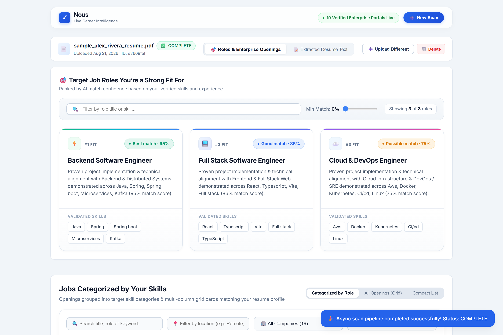
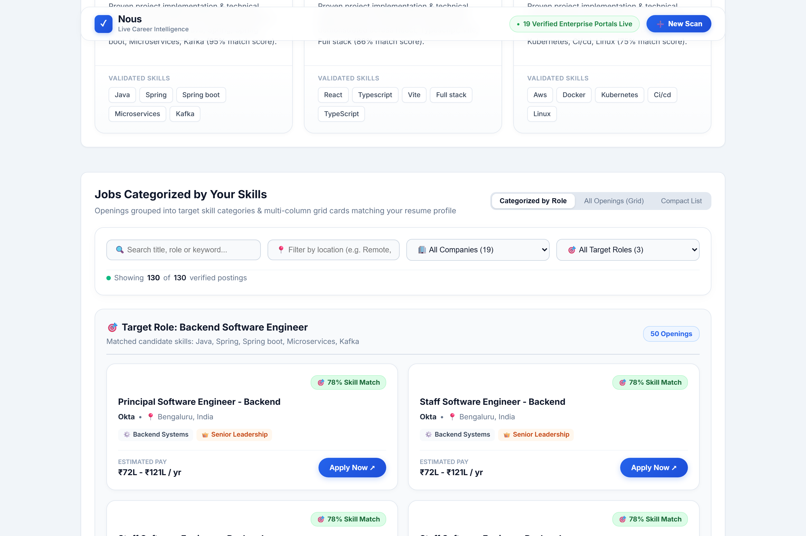
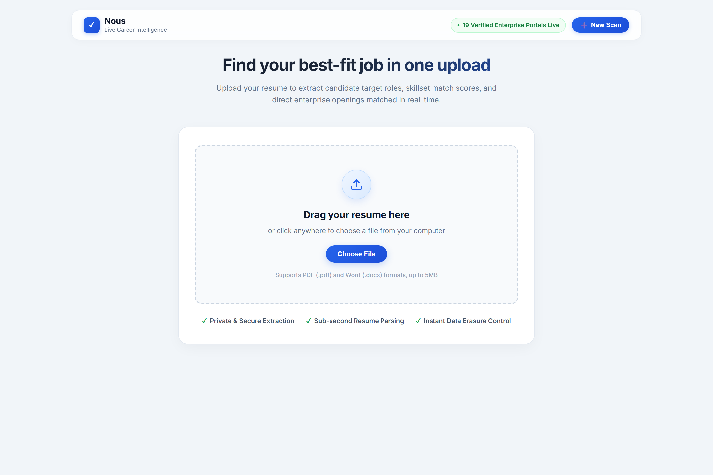
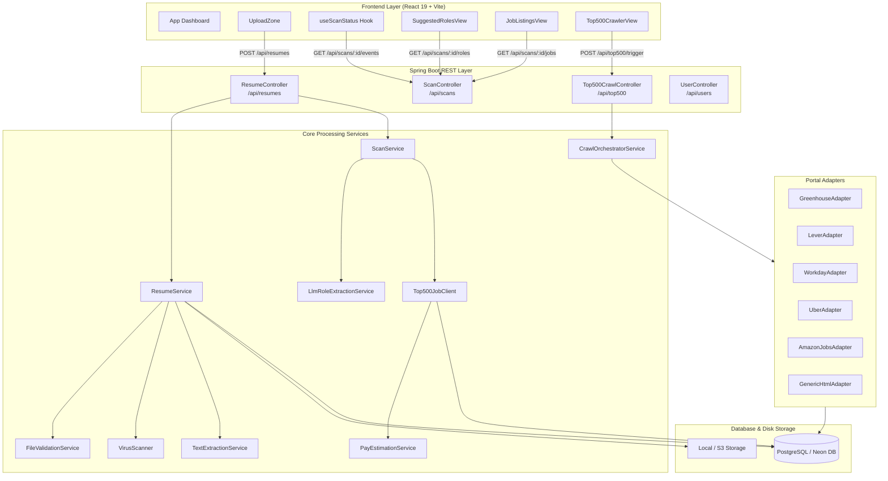

# 🧠 Nous AI — Intelligent Resume Scanner & Live Enterprise Job Matcher

<div align="center">


<p align="center">
  <strong>An enterprise-grade AI resume intelligence platform and automated direct job discovery engine.</strong><br>
  Parses resumes, extracts practical project skills, infers target career roles, computes realistic compensation bands, and matches candidates against verified live job postings directly crawled from Top 500 Enterprise career portals.
</p>

</div>

---

<div align="center">
  
</div>

---

## 📌 Table of Contents

- [Project Description](#-project-description)
  - [The Problem with Traditional Job Portals](#the-problem-with-traditional-job-portals)
  - [The Nous AI Solution](#the-nous-ai-solution)
  - [Core Use Cases & Target Audience](#core-use-cases--target-audience)
- [Key Features](#-key-features)
- [Real UI Showcase](#-real-ui-showcase--live-dashboard)
- [System Architecture](#-system-architecture)
- [Technology Stack](#-technology-stack)
- [Project Directory Structure](#-project-directory-structure)
- [REST & Streaming API Reference](#-rest--streaming-api-reference)
- [Getting Started](#-getting-started)
  - [Prerequisites](#prerequisites)
  - [Backend Setup (Spring Boot)](#backend-setup-spring-boot)
  - [Frontend Setup (React + Vite)](#frontend-setup-react--vite)
- [Environment Configuration](#-environment-configuration)
- [Running Tests](#-running-tests)
- [License](#-license)

---

## 🌟 Project Description

**Nous AI** is an advanced, enterprise-grade AI resume intelligence platform and automated career matching engine designed to modernize how candidates discover career opportunities and how software engineers are evaluated.

### 🛑 The Problem with Traditional Job Portals
1. **Keyword Stuffing over True Competence:** Conventional Applicant Tracking Systems (ATS) rely on simple keyword frequency matches, rewarding resumes packed with buzzwords rather than authentic engineering accomplishments.
2. **Stale Aggregator Listings:** Most job boards display third-party listings that have already closed, were reposted by recruiting agencies, or lead to broken referral redirect chains.
3. **Lack of Compensation Transparency:** Candidates rarely receive realistic compensation estimates calibrated to their actual seniority, domain expertise, and geographic market.
4. **Slow, Opaque Feedback Loops:** Traditional job sites offer zero instant insights into which target roles best match a candidate's actual project experience.

### 💡 The Nous AI Solution
Nous AI addresses these challenges through a unified, privacy-focused 4-stage pipeline:
- **Intelligent Contextual Ingestion:** Securely ingests PDF and DOCX files, verifies MIME authenticity using Apache Tika magic-byte inspection, extracts clean plaintext with Apache PDFBox and POI, and prevents duplicate processing with SHA-256 deduplication.
- **Recruiter-Grade AI Role Intelligence:** Leverages Google Gemini Live API (with dynamic heuristic semantic parsing as fallback) applying a **45% weight to project implementations** and system architectures built, identifying true candidate proficiency beyond superficial skill lists.
- **Direct Enterprise Career Portal Crawler:** Scrapes open requisitions directly from verified corporate career portals (including Microsoft, Amazon, Google, Meta, Stripe, Datadog, Uber, Okta, etc.) via dedicated ATS adapters (Greenhouse, Lever, Workday CXS, and Schema.org JSON-LD microdata) on an automated 12:00 PM daily schedule.
- **Localized Compensation Calibration:** Accurately computes realistic salary bands across 7 global currency markets (e.g. `₹35L - ₹65L / yr` for India, `$160k - $240k` for US), 7 seniority tiers, and 8 domain multipliers.
- **Reactive Real-Time Streaming:** Streams processing status updates directly to a responsive React 19 single-page dashboard via Server-Sent Events (`SseEmitter`), backed by automatic REST polling fallback.

### 🎯 Core Use Cases & Target Audience
- **Software Engineers & Job Seekers:** Upload a resume to instantly discover calibrated target job titles (e.g. *Backend Engineer*, *Full Stack Architect*, *Cloud/DevOps*), view match percentages, and deep-link directly into verified enterprise career portals with one click.
- **Tech Recruiters & Talent Acquisition Teams:** Perform automated candidate resume screening, extract verified technical skill sets, and benchmark market compensation expectations.
- **Career Centers & Engineering Bootcamps:** Evaluate student portfolios and resumes against real-time live market demands across Top 500 tech companies.

---

## 🚀 Key Features

### 📄 1. Multi-Format Secure Ingestion
- **Magic-Byte Sniffing:** Analyzes raw binary headers via **Apache Tika** to detect true MIME types (`application/pdf` and `application/vnd.openxmlformats-officedocument.wordprocessingml.document`), preventing extension spoofing.
- **Virus & Malware Scanning:** Streams file bytes over TCP to **ClamAV** daemon (`3310`) with automatic fallback to `NoOpVirusScanner` for local development.
- **SHA-256 Deduplication:** Computes SHA-256 hex digests upon byte read to prevent redundant database writes and duplicate scan executions.
- **Text Extraction:** Uses **Apache PDFBox** (`PDFTextStripper` with reading order preservation and encryption guards) and **Apache POI** (`XWPFWordExtractor`).

### 🤖 2. Multi-Tier AI Role Intelligence
- **Google Gemini Live API:** Analyzes candidate resumes using a Staff Technical Recruiter evaluation prompt:
  - **45% Weight:** Practical project execution & system architectures built.
  - **30% Weight:** Core technical stack mastery.
  - **15% Weight:** Seniority & domain alignment.
  - **10% Weight:** Infrastructure, CI/CD, and tooling.
- **OpenAI / Groq / OpenRouter Fallback:** Integrated REST client with strict JSON schema response enforcement.
- **Dynamic Semantic Resume Parser:** Zero-static fallback evaluating 6 domain clusters with **3x multiplier** for technologies verified in actual projects, generating calibrated confidence curves.

### 🏢 3. Top 500 Enterprise Career Portal Crawler
- **Direct ATS Integration:** Live API and CXS scrapers for:
  - **Greenhouse ATS:** Direct public board JSON feeds.
  - **Lever ATS:** Public postings JSON API.
  - **Workday CXS:** Standard enterprise CXS REST querying.
  - **Uber & Amazon Jobs:** Direct JSON requisition search APIs.
  - **Generic HTML & Schema.org:** Jsoup parser extracting `JobPosting` JSON-LD microdata.
- **Scheduled Automated Screening:** `@Scheduled(cron = "0 0 12 * * *")` triggers full batch screening at 12:00 PM IST daily.
- **Soft Expiration:** Unseen job postings in subsequent crawl batches are soft-expired (`is_currently_open = false`).

### 💰 4. Intelligent Market Pay Estimation Engine
- **7 Geographic Regions & Currencies:** India (`INR ₹Lakhs`), US/Remote (`USD $k`), UK (`GBP £k`), Europe (`EUR €k`), Canada (`CAD $k`), Singapore (`SGD $k`), Australia (`AUD $k`).
- **7 Seniority Tiers:** Intern, Junior, Mid, Senior, Staff/Principal, Manager, Executive.
- **8 Domain Multipliers:** AI/Data (1.20x), Security (1.15x), Backend (1.10x), Product (1.05x), Software Engineering (1.00x), Design (0.95x), Sales (0.90x), Business Ops (0.80x).

### ⚡ 5. Real-Time Streaming & Privacy
- **Server-Sent Events (`SseEmitter`):** Real-time push updates to the UI as the pipeline advances (`PENDING` $\rightarrow$ `PROCESSING` $\rightarrow$ `COMPLETE`).
- **Dual-Channel Resilience:** React hook (`useScanStatus.js`) auto-downgrades from SSE to 1500ms REST polling if streams disconnect.
- **Privacy & Right to Erasure:** Deleting a resume cascades removal across `job_listings`, `suggested_roles`, `scans`, and removes the physical file from disk.

---

## 📸 Real UI Showcase & Live Dashboard

<div align="center">

### 1. AI Target Role Extraction & Match Scores


### 2. Verified Live Enterprise Openings & Pay Calibration


### 3. Clean Drag-and-Drop Ingestion Zone


</div>

---

## 🏗️ System Architecture



---

## 💻 Technology Stack

| Layer | Technology | Version | Purpose |
| :--- | :--- | :--- | :--- |
| **Backend Framework** | Spring Boot | `3.3.4` | Core MVC, REST APIs, dependency injection |
| **Java Platform** | OpenJDK / Java | `17` | Language runtime with modern switch & record semantics |
| **Persistence** | Spring Data JPA / Hibernate | `6.5.3` | Relational ORM & schema management |
| **Database** | PostgreSQL / Neon DB | `16` | Production serverless cloud database |
| **In-Memory DB** | H2 Database | `2.2.224` | Local rapid development & testing |
| **PDF Extraction** | Apache PDFBox | `3.0.3` | Reading PDF text layers & font glyph maps |
| **DOCX Extraction** | Apache POI | `5.3.0` | Parsing Office OpenXML document paragraphs |
| **MIME Sniffing** | Apache Tika | `2.9.2` | Magic-byte MIME type inspection |
| **HTML Scraping** | Jsoup | `1.17.2` | Parsing HTML & Schema.org JSON-LD |
| **Frontend Framework**| React | `19.2.8` | Declarative component UI |
| **Build Tool** | Vite | `8.2.0` | Fast HMR dev server & asset bundler |
| **Styling** | Vanilla CSS | CSS3 | Responsive custom design tokens & glassmorphism |

---

## 📁 Project Directory Structure

```
nous/
├── pom.xml                               # Backend Maven configuration
├── Dockerfile                            # Production container build definition
├── render.yaml                           # Cloud deployment blueprint
├── docs/
│   └── images/
│       ├── nous_banner_preview.jpg       # Product showcase banner
│       └── nous_pipeline_workflow.jpg    # Pipeline infographic
├── src/
│   ├── main/
│   │   ├── java/com/project/nous/
│   │   │   ├── NousApplication.java      # Application entrypoint (@EnableScheduling)
│   │   │   ├── config/                   # Async, CORS, RestClient & LLM configurations
│   │   │   ├── controller/               # REST API Controllers & Error Handlers
│   │   │   ├── domain/                   # JPA Entity Models (Resume, Scan, JobPosting, etc.)
│   │   │   ├── dto/                      # Data Transfer Objects & Record responses
│   │   │   ├── exception/                # Domain exceptions & RFC 7807 ExceptionHandler
│   │   │   ├── repository/               # Spring Data JPA Repository interfaces
│   │   │   └── service/                  # Business logic services & portal adapters
│   │   │       └── adapter/              # Greenhouse, Lever, Workday, Uber, Amazon adapters
│   │   └── resources/
│   │       ├── application.properties    # Production configuration (Neon PostgreSQL)
│   │       └── application-dev.properties# Local development profile (H2 in-memory DB)
│   └── test/java/com/project/nous/       # Unit & Integration test suites
└── frontend/
    ├── package.json                      # Frontend dependencies & scripts
    ├── vite.config.js                    # Vite configuration & backend proxy
    ├── index.html                        # Application HTML entry point
    └── src/
        ├── main.jsx                      # React 19 root bootstrap
        ├── App.jsx                       # Master Dashboard & tab router
        ├── index.css                     # Global CSS design tokens
        ├── components/                   # UI components (UploadZone, JobCard, RoleCard, etc.)
        ├── hooks/                        # Custom React hooks (useScanStatus.js)
        └── services/                     # API client service layer (api.js)
```

---

## 📡 REST & Streaming API Reference

### 1. Resume Operations (`/api/resumes`)
- `POST /api/resumes`: Upload a resume (`.pdf` or `.docx`, max 5MB). Returns `202 Accepted` with initial `scanId`.
- `GET /api/resumes/{id}`: Fetch metadata, character count, and text preview.
- `GET /api/resumes/{id}/text`: Fetch full plain extracted resume text.
- `DELETE /api/resumes/{id}`: Privacy erase. Cascades deletion across database records and deletes physical file on disk.

### 2. Scan Engine & AI Role Intelligence (`/api/scans`)
- `GET /api/scans/{scanId}`: Fetch current scan status enriched with top recommended role.
- `GET /api/scans/{scanId}/events`: **Server-Sent Events (SSE)** real-time push stream (`text/event-stream`).
- `GET /api/scans/{scanId}/roles`: Fetch AI recommended target roles, match scores, and parsed skill sets.
- `GET /api/scans/{scanId}/jobs`: Fetch matched live enterprise openings with deep apply links.

### 3. Top 500 Enterprise Management (`/api/top500`)
- `GET /api/top500/companies`: List monitored enterprise companies and portal statuses.
- `POST /api/top500/trigger`: Trigger manual asynchronous batch crawl across all connected portals.
- `GET /api/top500/runs`: View recent batch crawl execution metrics and logs.
- `GET /api/top500/postings?query=...`: Search active enterprise openings by title, company, or keyword.

### 4. User History (`/api/users`)
- `GET /api/users/{userId}/scans`: Fetch scan evaluation history across all resumes submitted by a user.

---

## 🚀 Getting Started

### Prerequisites
- **Java JDK 17+** installed (`java -version`)
- **Maven 3.8+** installed (`mvn -version`)
- **Node.js 18+** & **npm** installed (`node -v`)

---

### Backend Setup (Spring Boot)

#### Option A: Quick Local Dev Mode (In-Memory H2 Database)
Run the backend with the `dev` profile. No external database or credentials required:
```bash
# From the project root
mvn spring-boot:run -Dspring-boot.run.profiles=dev
```
- Server starts at: `http://localhost:8080`
- H2 Browser Console: `http://localhost:8080/h2-console` (JDBC URL: `jdbc:h2:mem:nousdev`)

#### Option B: Production Mode (PostgreSQL / Neon DB)
1. Copy `.env.example` to `.env` and provide your credentials:
```env
NEON_DB_URL=jdbc:postgresql://ep-example.region.aws.neon.tech/nous?sslmode=require
NEON_DB_USER=your_db_username
NEON_DB_PASSWORD=your_db_password
GEMINI_API_KEY=your_google_gemini_api_key
```
2. Start the application:
```bash
mvn spring-boot:run
```

---

### Frontend Setup (React + Vite)

```bash
# Navigate to the frontend directory
cd frontend

# Install dependencies
npm install

# Start Vite development server
npm run dev
```
- Open browser at: `http://localhost:5173`
- The Vite proxy automatically routes all `/api/*` calls to the Spring Boot backend on port `8080`.

---

## ⚙️ Environment Configuration

| Variable | Default Value | Description |
| :--- | :--- | :--- |
| `PORT` | `8080` | Backend HTTP server port |
| `NEON_DB_URL` | - | PostgreSQL JDBC connection URL (requires SSL) |
| `NEON_DB_USER` | - | PostgreSQL database username |
| `NEON_DB_PASSWORD` | - | PostgreSQL database password |
| `UPLOAD_DIR` | `./uploads` | Directory for storing uploaded resume files |
| `GEMINI_API_KEY` | `mock-key` | Google Gemini API Key for Live LLM role analysis |
| `GEMINI_MODEL` | `gemini-flash-latest` | Preferred Gemini model name |
| `LLM_API_KEY` | `mock-key` | OpenAI / Groq / OpenRouter API Key fallback |
| `JOB_API_PROVIDER` | `top500` | Job client strategy (`top500` or `mock`) |
| `app.clamav.enabled` | `false` | Enable ClamAV TCP daemon malware scanning |

---

## 🧪 Running Tests

Execute the complete test suite (controllers, services, repositories, and adapters):
```bash
mvn clean test
```

---

## 📄 License

This project is licensed under the MIT License — see the [LICENSE](LICENSE) file for details.

<div align="center">
  <sub>Built with ❤️ by the Nous Engineering Team.</sub>
</div>
