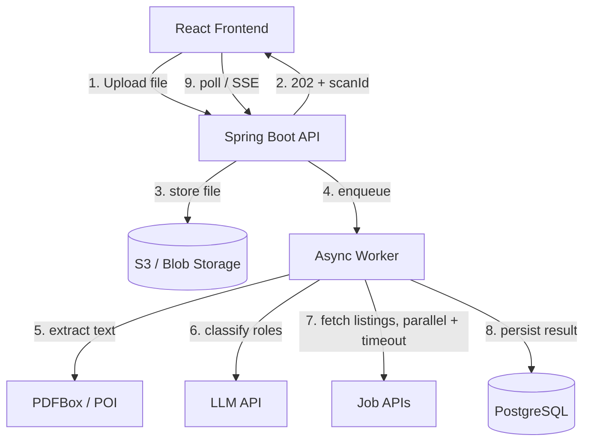

# AI Resume Scanner & Job Finder — High-Level Engineering Plan

*Reviewed and restructured from a senior engineering perspective*

## 1. Product Summary

Users upload a resume. The system extracts text, uses an LLM to infer the top job roles the candidate is suited for, queries external job-board APIs for live openings in those roles, and returns application links. Results are persisted so users can revisit past scans.

**Stack:** Java Spring Boot (backend), React (frontend), PostgreSQL (storage), external LLM API, external job-search APIs.

The original plan captured the right pieces but treated this as a simple synchronous CRUD app. It isn't — it's a **multi-step pipeline with two slow, unreliable third-party dependencies** (LLM + job APIs) in the critical path. That distinction should drive most of the architecture. Below is the plan with that fixed, plus the gaps a senior review typically catches: async processing, idempotency, failure handling, security on file upload, cost control, and observability.

---

## 2. Architecture

The key call I'd make differently from the original: **don't process the upload synchronously in the request thread.** A single `/upload` call that does text extraction → LLM call → 3 job API calls → DB write, all before responding, will:
- Time out on slow LLM responses (5–15s is common, sometimes 30s+)
- Retry-storm if the client or a proxy times out and the user hits "upload" again
- Make horizontal scaling awkward (long-held threads/connections)

**Recommended flow:**

```
React Frontend
     │  1. POST /api/resumes (multipart upload)
     ▼
Spring Boot API ──► validate file, store to S3/blob, write `resumes` row (status=PENDING)
     │  2. return 202 Accepted + scanId immediately
     │  3. publish ScanRequested event
     ▼
Async Worker (same service, @Async/executor — or separate consumer if scale demands it)
     │  4. extract text (PDFBox/POI)
     │  5. call LLM → top roles (with schema validation + retry)
     │  6. call job APIs per role (parallel, with per-call timeout + fallback)
     │  7. write scan_results (status=COMPLETE / PARTIAL / FAILED)
     ▼
React Frontend
     │  8. poll GET /api/scans/{id} or subscribe via WebSocket/SSE for status
```

This keeps the same tech stack from the original plan but changes the interaction pattern from "wait for one big request" to "submit, then poll/subscribe for status" — which is the standard pattern for any pipeline with an LLM call in it.



---

## 3. Data Model (PostgreSQL)

Mostly matches the original, with status tracking and normalization added — you need to know *where* a scan is in the pipeline and *why* it failed if it does.

- **`users`**: `id`, `email` (unique), `name`, `created_at`
- **`resumes`**: `id`, `user_id` (FK), `file_url`, `file_hash` (dedupe re-uploads), `extracted_text`, `uploaded_at`
- **`scans`**: `id`, `resume_id` (FK), `status` (`PENDING`/`PROCESSING`/`COMPLETE`/`PARTIAL`/`FAILED`), `error_reason`, `created_at`, `completed_at`
- **`suggested_roles`**: `id`, `scan_id` (FK), `role_name`, `rank`, `confidence` — normalized instead of a JSONB blob, so you can query/report on which roles get suggested most often
- **`job_listings`**: `id`, `scan_id` (FK), `role_id` (FK), `title`, `company`, `apply_url`, `source_api`, `fetched_at`

Normalizing `suggested_roles` and `job_listings` into real tables (instead of the original's JSONB columns) costs a bit more upfront modeling but pays off the first time you want to answer "which roles are we suggesting most" or "which job API returns the most listings" — that's a `GROUP BY`, not a JSONB parse in application code.

---

## 4. API Design

| Method | Endpoint | Description |
|---|---|---|
| `POST` | `/api/resumes` | Upload file, returns `202` + `scanId` |
| `GET` | `/api/scans/{scanId}` | Current status + results if complete |
| `GET` | `/api/scans/{scanId}/events` | SSE stream for live status (optional, nicer UX than polling) |
| `GET` | `/api/users/{userId}/scans` | Scan history |
| `DELETE` | `/api/resumes/{resumeId}` | Delete resume + associated data (needed for privacy compliance — see §7) |

---

## 5. Phased Delivery

### Phase 1 — Upload & Extraction
- File upload with **strict validation**: MIME-type check (not just extension), max size (e.g. 5MB), PDF/DOCX only, malware scan if feasible (e.g. ClamAV) before the file touches disk long-term.
- Text extraction via PDFBox/POI.
- Store extracted text; no AI yet. Get the boring plumbing solid first.

### Phase 2 — Async Pipeline Skeleton
- Introduce the `scans` table and status machine described above.
- Wire up `202 Accepted` + polling endpoint, even before the LLM/job API calls exist — this is the architectural shift that's cheapest to make early and expensive to retrofit later.

### Phase 3 — LLM Role Matching
- Call the LLM with a prompt that requests **strict JSON output** (name the schema explicitly, e.g. `{"roles": [{"name": str, "confidence": float}]}`).
- Validate the response against that schema before trusting it — LLMs occasionally wrap JSON in prose or return malformed structures. Fail the scan gracefully (status=`FAILED`, informative `error_reason`) rather than 500ing.
- Add a timeout (e.g. 20s) and one retry with backoff.

### Phase 4 — Job API Integration
- Adzuna/Jooble calls per role, **in parallel**, each with its own timeout.
- If one role's job search fails but others succeed, return `PARTIAL` with what you have rather than failing the whole scan — partial results are usually still useful to the user.
- Cache job API responses briefly (e.g. Redis, 1hr TTL) keyed on role — job listings don't change minute to minute, and this cuts cost/latency for popular roles.

### Phase 5 — Persistence & History
- Wire the worker to persist into the normalized schema.
- Build `GET /api/users/{userId}/scans`.

### Phase 6 — Frontend Polish
- Upload with progress state, then a "processing…" state that polls or listens via SSE, then results.
- Design for `PARTIAL` and `FAILED` states explicitly — don't just design the happy path. A resume that returns roles but no job listings for one role is a real, expected outcome, not an edge case.

---

## 6. Cross-Cutting Concerns Missing From the Original Plan

These aren't a separate phase — they need to be decided early because retrofitting them is expensive:

- **Idempotency:** if a user double-clicks upload, or a client retries after a timeout, you want a `file_hash` check or idempotency key so you don't run the (costly) LLM pipeline twice on the same resume.
- **Cost control:** every scan costs real money (LLM tokens + job API calls, some of which are rate-limited/paid tiers). Add basic per-user rate limiting on `/api/resumes` from day one — an unbounded pipeline connected to a paid LLM API is a real cost/abuse risk in production.
- **Observability:** structured logging with a `scanId` correlation ID through the whole pipeline, plus metrics on stage latency (extraction time, LLM latency, job API latency) and failure rate per stage. When something breaks, you want to know *which* stage broke without reading application code.
- **Testing:** unit tests for the parsing/extraction logic (deterministic), contract tests for the job API clients (mocked), and a smaller set of integration tests that stub the LLM response rather than hitting a real API in CI (cost + flakiness).
- **Secrets management:** LLM and job API keys via environment/secret store, never checked in — obvious, but worth stating since the original plan didn't mention it.

---

## 7. Security & Privacy

Resumes contain PII (name, contact info, sometimes address, sometimes demographic-adjacent info). This needs explicit handling, not an afterthought:

- Encrypt file storage at rest (S3 SSE or equivalent).
- Scope access: a resume/scan is only readable by its owning user — enforce at the query layer, not just the UI.
- Provide resume/data deletion (`DELETE /api/resumes/{id}`) that actually removes the file from blob storage, not just the DB row — needed for basic privacy compliance (GDPR/CCPA-style "right to deletion" if you have EU/CA users).
- Don't log full extracted resume text in application logs (PII in logs is a common, avoidable compliance problem).

---

## 8. Post-MVP / Future Scope

Same as the original, plus a couple additions:
- OCR (Tesseract/AWS Textract) for scanned/image PDFs.
- Resume-to-job-description match scoring.
- S3 for file storage (should arguably be in MVP, not post-MVP, if this is going to be a real deployed product rather than a local demo).
- Auth via Spring Security + JWT/OAuth2.
- **Prompt/response versioning:** log which LLM model + prompt version produced each scan's roles, so if you change the prompt later you can compare quality across versions rather than flying blind.
- **A/B-able job source ranking:** if you add more job APIs later, track which source's listings get clicked/applied-to most, to prioritize which to call first (cost control again).

---

## 9. Summary of Key Changes From the Original Plan

| Original | Revised | Why |
|---|---|---|
| Synchronous upload → AI → job API → response | Async: `202` + background worker + poll/SSE | LLM + external API latency makes synchronous unreliable at any real scale |
| `suggested_roles`/`job_listings` as JSONB | Normalized tables | Queryability, reporting, easier to extend later |
| No status field | `scans.status` state machine | Failures are partial/expected, not exceptional — model them |
| No mention of security/PII | Explicit section | Resumes are sensitive PII; this isn't optional |
| No cost/rate-limit controls | Explicit rate limiting + caching | Unbounded calls to paid LLM/job APIs is a real production risk |
| Local file storage in Phase 1, S3 "future" | S3 recommended from MVP | Cheap to do correctly now, annoying to migrate later |
